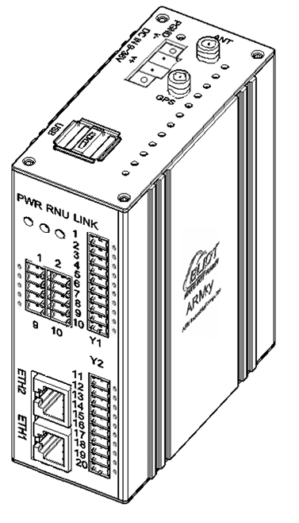
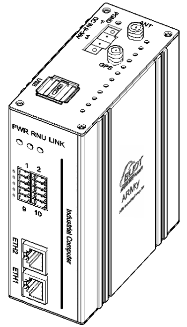

ARM工业计算机控制器技术规格书

<figure>

<figcaption>
ARMxy BL310系列技术规格书
</figcaption>
</figure>

版本说明

<table>
<colgroup>
<col style="width: 18%" />
<col style="width: 19%" />
<col style="width: 18%" />
<col style="width: 43%" />
</colgroup>
<tbody>
<tr>
<td style="text-align: center;">修改人</td>
<td style="text-align: center;">版本</td>
<td style="text-align: center;">日期</td>
<td style="text-align: center;">修改内容</td>
</tr>
<tr>
<td style="text-align: left;"><blockquote>

Panghao

</blockquote></td>
<td style="text-align: center;">V1.0</td>
<td style="text-align: center;">2024-03-30</td>
<td style="text-align: center;">初次发布</td>
</tr>
<tr>
<td style="text-align: center;">Panghao</td>
<td style="text-align: center;">V1.1</td>
<td style="text-align: center;">2026-07-15</td>
<td style="text-align: center;"><ol type="1">
<li>
修改公司地址
</li>
<li>
新增复位按键自定义说明
</li>
<li>
新增codesys版本说明
</li>
</ol></td>
</tr>
</tbody>
</table>

|     |     |     |     |     |
|-----|-----|-----|-----|-----|
|     |     |     |     |     |
|     |     |     |     |     |

# 一、产品概述

ARMxy系列的ARM嵌入式计算机BL310系列是一款可灵活配置IO口的工业级ARM控制器，采用‌NXP的i.MX6ULL工业级高性能低功耗的SoC，基于ARM Cortex-A7内核处理器，运行速度最高可达800MHz‌‌，提供宽温级、工业级的不同RAM与ROM组合的SoM，提供256MB/512MB DDR3L的RAM、1G/8GB eMMC的ROM等多种配置，满足不同应用需求‌，它还支持丰富的可选I/O接口。BL310系列广泛应用于工业物联网关、工业控制、智能终端、自动化控制、交通轨道、电力、工业4.0、智能制造、工业检测、医疗设备等领域。

BL310系列ARM嵌入式计算机提供2个10/100Mbps自适应RJ45网口、2xUSB2.0、1个可选的X系列IO板，2个可选的Y系列IO板等丰富的接口，涵盖RS485、RS232、CAN、DI、DO、继电器、AI、A0、RTD热电阻、TC热电偶、IEPE压电采集等，可用作PWM输出、脉冲计数等数据采集与控制。内置Mini PCIE接口，支持WiFi、4G模块通信。

BL310系列ARM嵌入式计算机支持Linux-4.1.15内核的系统、开发工具。同时支持BLIoTLink工业协议转换软件用于工业数据采集与转换，快速接入各种主流物联网云平台与工业组态软件SCADA等，通过BLRAT远程访问工具实现远程访问与运维，支持Node-Red可以快速实现物联网应用等。预装QuickConfig快速配置工具，可以远程快速配置和调试设备，高工作效率；支持Node-Red可以快速实现物联网应用等。此外还可以通过AI辅助编写应用程序，支持“所述即所得”的编程方式。

BL310系列ARM嵌入式计算机经过专业的电气性能设计和高低温测试验证，可稳定可靠地工作在恶劣的电磁干扰与 -40~85℃温度下，DIN35导轨安装，可满足各种工业应用环境。

# 二、典型应用领域

✓ 工业控制 ✓ 智能终端

✓ 工业物联网关 ✓ 自动化控制

✓ 轨道交通 ✓ 智能设备

✓ 工业测量 ✓ 储能系统

# 三、软硬件参数

***无Y板的产品外观结构：*** ***1块Y板的产品外观结构：*** ***2块Y板的产品外观结构：***

1.  

## 硬件参数

<table>
<colgroup>
<col style="width: 19%" />
<col style="width: 80%" />
</colgroup>
<tbody>
<tr>
<td rowspan="2">CPU</td>
<td>NXP i.MX6ULL</td>
</tr>
<tr>
<td>Cortex-A7@800MH</td>
</tr>
<tr>
<td>ROM</td>
<td>8GB eMMC/1G NandFlash</td>
</tr>
<tr>
<td>RAM</td>
<td>256MB/512MB DDR3L</td>
</tr>
<tr>
<td>ETH</td>
<td>2x10/100Mbps自适应RJ-45接口，ESD 3级，EFT 3级</td>
</tr>
<tr>
<td>USB</td>
<td>1x USB2.0 HOST, 1x USB2.0 OTG，速率高达 480Mbps ，ESD 3级</td>
</tr>
<tr>
<td>IO槽</td>
<td>
X系列IO板槽：1个，可选X系列IO板，支持RS485、CAN、RS232、GPIO等；

Y系列IO板槽：2个，可选Y系列IO板，支持RS485、RS232、DI、DO、继电器输出模块、AI、AO、PT100、PT1000、热电偶等。
</td>
</tr>
<tr>
<td rowspan="2">LED</td>
<td>1x 电源指示灯</td>
</tr>
<tr>
<td>2x 用户可编程指示灯</td>
</tr>
<tr>
<td>Mini PCIE</td>
<td>1个，支持蓝牙、WiFi、4G模块等</td>
</tr>
<tr>
<td>SIMCard槽</td>
<td>1个，NANO</td>
</tr>
<tr>
<td>天线接口</td>
<td>2个，用于4G/WIFI/GPS等</td>
</tr>
<tr>
<td>Debug</td>
<td>1个Micro USB调试口</td>
</tr>
<tr>
<td>SD卡槽</td>
<td>1个</td>
</tr>
<tr>
<td>复位按键</td>
<td>1个复位按键，支持自定义功能（购买前说清楚用途）</td>
</tr>
<tr>
<td>独立看门狗</td>
<td>板载独立硬件看门狗</td>
</tr>
<tr>
<td>电源</td>
<td>额定DC 24V，支持宽电压12-24VDC，具备反接保护，过流保护。2PIN带螺钉端子。</td>
</tr>
<tr>
<td>接地</td>
<td>1PIN接地连接点</td>
</tr>
<tr>
<td>安装方式</td>
<td>DIN35导轨安装、墙面固定安装</td>
</tr>
<tr>
<td>材质</td>
<td>铝合金外壳</td>
</tr>
<tr>
<td>尺寸</td>
<td>110*83*42mm、110*83*48mm</td>
</tr>
</tbody>
</table>

## 软件参数

|          |                       |
|----------|-----------------------|
| 内核     | Linux-4.1.15          |
| 操作系统 | Debian10、Linux4.1.15 |
|          |                       |
|          |                       |
|          |                       |

## 软件生态

| **软件名称** | **类型** | **核心功能** | **主要应用场景** |
|:--:|:---|:---|:---|
| **BLIoTLink** | 自研 | 工业协议采集与转换（Modbus、BACnet、DLT645、IEC104等），对接云平台与SCADA | 楼宇自动化、工厂监控、智慧水务 |
| **Node-RED** | 开源 | 可视化流编程，拖拽构建物联网逻辑流（HTTP、MQTT、数据库等） | 边缘计算、多协议融合、自定义规则引擎 |
| **QuickConfig** | 自研 | 图形化一站式配置管理，含网络切换、系统监控、AI代码助手、远程运维 | 网关部署与运维、开发辅助 |
| **BLRAT** | 自研 | 免费远程访问工具，三步连接，多设备兼容 | 设备远程运维与访问 |
| **NEXPLC** | 自研 | 工业4.0软PLC，支持标准化编程、多语言、云对接 | 工业/楼宇/能源自动化控制 |
| **OpenPLC** | 开源 | IEC 61131-3标准软PLC，支持梯形图等5种语言 | 小型设备本地控制、安全联锁、边缘逻辑执行 |
| **FUXA** | 开源 | 基于Web的SCADA/HMI，拖拽式监控画面，支持Modbus/OPC UA/MQTT | 产线监控大屏、智慧水务、能源管理驾驶舱 |
| **Ignition** | 开源 | 集成SCADA、MES、IIoT的工业自动化平台，Web架构无客户端限制 | 工厂级中央监控与数据平台 |
| **Thingsboard IoT Gateway** | 开源 | 非IP设备（Modbus/CAN等）转MQTT/HTTP，对接Thingsboard平台 | 物联网数据采集与云桥接 |
| **Grafana** | 开源 | 时序数据可视化与分析，近百种数据源，丰富仪表盘 | 数据分析与运维监控驾驶舱 |
| **Vnode** | 开源 | 轻量级边缘计算/函数运行时，优化嵌入式环境 | 数据预处理、Node-RED补充/替代 |
| **Docker** | 开源 | 应用容器化，一键部署、隔离运行、统一管理 | 边缘多应用部署与运维 |
| **YOLOv5/8** | 开源 | 实时目标检测算法，支持自定义训练，适配边缘推理 | 工业质检、安全生产（安全帽/入侵识别）、仪表读数 |
| **OpenCV** | 开源 | 计算机视觉基础库（图像处理、特征检测、校准等） | 视觉类方案的底层算法支撑 |
| **其他** | \- | Python、C#、MySQL、SQLite等常用开发与数据组件 | 各类应用开发与数据存储 |

# 四、产品选型

ARMxy系列ARM嵌入式控制器采用灵活的设计理念，可以根据需要灵活选择不同的SOM板实现不同的ROM与RAM的组合，采用不同的X板、Y板实现丰富的I/O组合，满足各种应用场景的需求。

产品命名规则为：

主机型号-SOM型号-X板型号-Y1板型号-Y2板型号-codesys版本

比如：

BL310-SOM311-X4-Pro-CR

表示2个以太网口，RAM为256MB DDR3L，ROM为1GB Nand Flash，2路RS485+2路CAN，-Pro-CR指带CNC+Robotics 高级运动控制功能。

如需增加WIFI，则在主型号后面加W表示，如BL310W-SOM311-X4-Pro-CR;

如需增加4G模块，则在主型号后面加L表示，如BL310L-SOM311-X4-Pro-CR。

**ARMxy BL310系列选型表**

|          |         |         |              |             |             |
|:--------:|:-------:|:-------:|:------------:|:-----------:|:-----------:|
| **型号** | **ETH** | **USB** | **X 板IO槽** | **Y板IO槽** |  **尺寸**   |
|  BL310   | 2x100M  |    2    |    2x5PIN    |      X      | 42x83x110mm |
|  BL310A  | 2x100M  |    2    |    2x5PIN    |      1      | 42x83x110mm |
|  BL310B  | 2x100M  |    2    |    2x5PIN    |      2      | 42x83x110mm |

**ARMxy BL310系列SOM选型表**

可以根据需求，选择合适的ROM、RAM以及温度等级。

|  |  |  |  |  |  |  |
|:--:|:--:|:--:|:--:|:--:|:--:|:--:|
| **型号** | **MCU** | **主频** | **内核** | **RAM** | **ROM** | **温度级别** |
| SOM311 | i.MX6ULL | 800MHz | ARM Cortex-A7 | 256MB DDR3L | 1GByte eMMC | 工业级 -40~85℃ |
| SOM312 | i.MX6ULL | 800MHz | ARM Cortex-A7 | 512MB DDR3L | 8GByte eMMC | 宽温级 -25~85℃ |
| SOM313 | i.MX6ULL | 800MHz | ARM Cortex-A7 | 512MB DDR3L | 8GByte eMMC | 工业级 -40~85℃ |

**X系列IO板选型表**

可以根据需求，在设备出厂前选择合适的X系列IO板，X板型号一旦选定，设备出厂后不可更改。

<table style="width:100%;">
<colgroup>
<col style="width: 28%" />
<col style="width: 14%" />
<col style="width: 14%" />
<col style="width: 14%" />
<col style="width: 14%" />
<col style="width: 12%" />
</colgroup>
<tbody>
<tr>
<td style="text-align: center;">型号</td>
<td style="text-align: center;">RS485</td>
<td style="text-align: center;">RS232</td>
<td style="text-align: center;">CAN</td>
<td style="text-align: center;">GPIO</td>
<td style="text-align: center;">PIN数</td>
</tr>
<tr>
<td style="text-align: center;">X0</td>
<td style="text-align: center;">x</td>
<td style="text-align: center;">x</td>
<td style="text-align: center;">x</td>
<td style="text-align: center;">8</td>
<td style="text-align: center;">2x5PIN</td>
</tr>
<tr>
<td style="text-align: center;">X1</td>
<td style="text-align: center;">4</td>
<td style="text-align: center;">x</td>
<td style="text-align: center;">x</td>
<td style="text-align: center;">x</td>
<td style="text-align: center;">2x5PIN</td>
</tr>
<tr>
<td style="text-align: center;">X2</td>
<td style="text-align: center;">x</td>
<td style="text-align: center;">4</td>
<td style="text-align: center;">x</td>
<td style="text-align: center;">x</td>
<td style="text-align: center;">2x5PIN</td>
</tr>
<tr>
<td style="text-align: center;">X3</td>
<td style="text-align: center;">2</td>
<td style="text-align: center;">2</td>
<td style="text-align: center;">x</td>
<td style="text-align: center;">x</td>
<td style="text-align: center;">2x5PIN</td>
</tr>
<tr>
<td style="text-align: center;">X4</td>
<td style="text-align: center;">2</td>
<td style="text-align: center;"><blockquote>

x

</blockquote></td>
<td style="text-align: center;"><blockquote>

2

</blockquote></td>
<td style="text-align: center;">x</td>
<td style="text-align: center;">2x5PIN</td>
</tr>
<tr>
<td style="text-align: center;">X5</td>
<td style="text-align: center;">x</td>
<td style="text-align: center;">2</td>
<td style="text-align: center;">2</td>
<td style="text-align: center;">x</td>
<td style="text-align: center;">2x5PIN</td>
</tr>
<tr>
<td style="text-align: center;">X6</td>
<td style="text-align: center;">2</td>
<td style="text-align: center;">x</td>
<td style="text-align: center;">x</td>
<td style="text-align: center;">4</td>
<td style="text-align: center;">2x5PIN</td>
</tr>
<tr>
<td style="text-align: center;">X7</td>
<td style="text-align: center;">x</td>
<td style="text-align: center;">2</td>
<td style="text-align: center;">x</td>
<td style="text-align: center;">4</td>
<td style="text-align: center;">2x5PIN</td>
</tr>
<tr>
<td style="text-align: center;">X8</td>
<td style="text-align: center;">1</td>
<td style="text-align: center;">1</td>
<td style="text-align: center;">1</td>
<td style="text-align: center;">2</td>
<td style="text-align: center;">2x5PIN</td>
</tr>
</tbody>
</table>

**Y系列IO板选型表**

可以根据需求，在设备出厂前选择合适的Y系列IO板，Y板型号一旦选定，设备出厂后不可更改。

<table style="width:100%;">
<colgroup>
<col style="width: 10%" />
<col style="width: 33%" />
<col style="width: 10%" />
<col style="width: 11%" />
<col style="width: 33%" />
</colgroup>
<tbody>
<tr>
<td style="text-align: center;"><strong>型号</strong></td>
<td style="text-align: center;"><strong>描述</strong></td>
<td rowspan="14" style="text-align: center;"></td>
<td style="text-align: center;"><strong>型号</strong></td>
<td style="text-align: center;"><strong>描述</strong></td>
</tr>
<tr>
<td style="text-align: center;">Y01</td>
<td style="text-align: center;">4DI+4DO模块 NPN</td>
<td style="text-align: center;">Y41</td>
<td style="text-align: center;">4路AO模块输出 0/4~20mA</td>
</tr>
<tr>
<td style="text-align: center;">Y02</td>
<td style="text-align: center;">4DI+4DO模块 PNP</td>
<td style="text-align: center;">Y43</td>
<td style="text-align: center;">4路AO模块输出 0~5/10V</td>
</tr>
<tr>
<td style="text-align: center;">Y03</td>
<td style="text-align: center;">4DI+4DO模块继电器【预留】</td>
<td style="text-align: center;">Y46</td>
<td style="text-align: center;">4路AO模块输出 ±5V/±10V</td>
</tr>
<tr>
<td style="text-align: center;">Y11</td>
<td style="text-align: center;">8路DI模块NPN</td>
<td style="text-align: center;">Y51</td>
<td style="text-align: center;">2路RTD模块三线PT100</td>
</tr>
<tr>
<td style="text-align: center;">Y12</td>
<td style="text-align: center;">8路DI模块PNP</td>
<td style="text-align: center;">Y52</td>
<td style="text-align: center;">2路RTD模块三线PT1000</td>
</tr>
<tr>
<td style="text-align: center;">Y21</td>
<td style="text-align: center;">8路DO模块PNP</td>
<td style="text-align: center;">Y53</td>
<td style="text-align: center;">2路RTD模块四线PT100</td>
</tr>
<tr>
<td style="text-align: center;">Y22</td>
<td style="text-align: center;">8路DO模块NPN</td>
<td style="text-align: center;">Y54</td>
<td style="text-align: center;">2路RTD模块四线PT1000</td>
</tr>
<tr>
<td style="text-align: center;">Y24</td>
<td style="text-align: center;">4路DO模块继电器</td>
<td style="text-align: center;"><del>Y56</del></td>
<td style="text-align: center;"><del>电阻测量</del></td>
</tr>
<tr>
<td style="text-align: center;">Y31</td>
<td style="text-align: center;">4路AI模块单端输入 0/4~20mA</td>
<td style="text-align: center;"><del>Y57</del></td>
<td style="text-align: center;"><del>电压测量</del></td>
</tr>
<tr>
<td style="text-align: center;">Y33</td>
<td style="text-align: center;">4路AI模块单端输入 0~5/10V</td>
<td style="text-align: center;">Y58</td>
<td style="text-align: center;">4路TC模块</td>
</tr>
<tr>
<td style="text-align: center;">Y34</td>
<td style="text-align: center;">4路AI模块差分输入 0~5/10V</td>
<td style="text-align: center;">Y63</td>
<td style="text-align: center;">4路RS485/RS232可选模块</td>
</tr>
<tr>
<td style="text-align: center;">Y36</td>
<td style="text-align: center;">4路AI模块差分输入 ±5V/±10V</td>
<td style="text-align: center;">Y95</td>
<td style="text-align: center;">4路PWM输出+4路脉冲计数（1路高速3路低速），NPN</td>
</tr>
<tr>
<td style="text-align: center;"><del>Y37</del></td>
<td style="text-align: center;"><del>4路IEPE测量模块</del></td>
<td style="text-align: center;">Y96</td>
<td style="text-align: center;">4路PWM输出+4路脉冲计数（1路高速3路低速）,PNP</td>
</tr>
</tbody>
</table>

**codesys版本**

<table>
<colgroup>
<col style="width: 21%" />
<col style="width: 78%" />
</colgroup>
<tbody>
<tr>
<td style="text-align: center;"><strong>版本号</strong></td>
<td style="text-align: center;"><strong>功能</strong></td>
</tr>
<tr>
<td style="text-align: center;">无</td>
<td style="text-align: center;">不带codesys功能</td>
</tr>
<tr>
<td style="text-align: center;">Pro</td>
<td style="text-align: center;">
(专业版)搭载 CODESYS，可选择运动控制授权(仅Pro版本可选):

无后缀:CODESYS 基础版，不带运动控制

-SM:带基本运动控制功能

-CR:带CNC+Robotics 高级运动控制功能
</td>
</tr>
</tbody>
</table>

# 五、电磁兼容性测试

<table>
<colgroup>
<col style="width: 10%" />
<col style="width: 17%" />
<col style="width: 15%" />
<col style="width: 11%" />
<col style="width: 21%" />
<col style="width: 7%" />
<col style="width: 16%" />
</colgroup>
<tbody>
<tr>
<td style="text-align: center;"><strong>测试类别</strong></td>
<td style="text-align: center;"><strong>测试项目</strong></td>
<td style="text-align: center;"><strong>测试标准</strong></td>
<td style="text-align: center;"><strong>测试等级</strong></td>
<td style="text-align: center;"><strong>测试条件</strong></td>
<td style="text-align: center;"><strong>测试结果</strong></td>
<td style="text-align: center;"><strong>备注</strong></td>
</tr>
<tr>
<td rowspan="2" style="text-align: center;"><strong>电磁发射</strong></td>
<td style="text-align: center;">传导发射</td>
<td style="text-align: center;">GB/T 9254 Class A</td>
<td style="text-align: center;">Class A</td>
<td style="text-align: center;">150 kHz - 30 MHz</td>
<td style="text-align: center;">合格</td>
<td style="text-align: center;">满足普通工业环境限值要求</td>
</tr>
<tr>
<td style="text-align: center;">辐射发射</td>
<td style="text-align: center;">GB/T 9254 Class A</td>
<td style="text-align: center;">Class A</td>
<td style="text-align: center;">30 MHz - 1 GHz</td>
<td style="text-align: center;">合格</td>
<td style="text-align: center;">满足普通工业环境限值要求</td>
</tr>
<tr>
<td rowspan="6" style="text-align: center;"><strong>抗扰度测试</strong></td>
<td style="text-align: center;">静电放电（ESD）</td>
<td style="text-align: center;">GB/T 17626.2</td>
<td style="text-align: center;">III 级</td>
<td style="text-align: center;">
接触放电 +/-4 kV

空气放电 +/-8 kV
</td>
<td style="text-align: center;">合格</td>
<td style="text-align: center;">—</td>
</tr>
<tr>
<td style="text-align: center;">射频辐射抗扰度</td>
<td style="text-align: center;">GB/T 17626.3</td>
<td style="text-align: center;">III 级</td>
<td style="text-align: center;">
场强 10 V/m，

80 MHz - 1 GHz
</td>
<td style="text-align: center;">合格</td>
<td style="text-align: center;">—</td>
</tr>
<tr>
<td style="text-align: center;">电快速瞬变脉冲群（EFT）</td>
<td style="text-align: center;">GB/T 17626.4</td>
<td style="text-align: center;">III 级</td>
<td style="text-align: center;">
电源线 2 kV

信号线 1 kV
</td>
<td style="text-align: center;">合格</td>
<td style="text-align: center;">—</td>
</tr>
<tr>
<td style="text-align: center;">浪涌（Surge）</td>
<td style="text-align: center;">GB/T 17626.5</td>
<td style="text-align: center;">III 级</td>
<td style="text-align: center;">
差模 2 kV

共模 4 kV
</td>
<td style="text-align: center;">合格</td>
<td style="text-align: center;">—</td>
</tr>
<tr>
<td style="text-align: center;">电压暂降和中断</td>
<td style="text-align: center;">GB/T 17626.11</td>
<td style="text-align: center;">III 级</td>
<td style="text-align: center;">
电压暂降70%

持续500ms，

完全中断10 ms
</td>
<td style="text-align: center;">合格</td>
<td style="text-align: center;">—</td>
</tr>
<tr>
<td style="text-align: center;">工频磁场抗扰度</td>
<td style="text-align: center;">GB/T 17626.8</td>
<td style="text-align: center;">III 级</td>
<td style="text-align: center;">
测试强度30 A/m

工频50 Hz
</td>
<td style="text-align: center;">合格</td>
<td style="text-align: center;">—</td>
</tr>
</tbody>
</table>

测试结论

本ARM工业计算机设备在普通工业环境的**电磁兼容性测试**中完全符合**GB/T系列标准**的要求，具备良好的电磁兼容性能，可在工业现场稳定运行。

# 六、环境适应性测试

<table>
<colgroup>
<col style="width: 14%" />
<col style="width: 13%" />
<col style="width: 30%" />
<col style="width: 10%" />
<col style="width: 30%" />
</colgroup>
<tbody>
<tr>
<td style="text-align: center;"><strong>测试项目</strong></td>
<td style="text-align: center;"><strong>测试标准</strong></td>
<td style="text-align: center;"><strong>测试条件</strong></td>
<td style="text-align: center;"><strong>测试结果</strong></td>
<td style="text-align: center;"><strong>备注</strong></td>
</tr>
<tr>
<td style="text-align: center;"><strong>低温启动与运行试验</strong></td>
<td style="text-align: center;">GB/T 2423.1-2008</td>
<td style="text-align: center;">环境温度 -40℃ 下，设备启动并正常运行</td>
<td style="text-align: center;">符合要求</td>
<td style="text-align: center;">满足工业环境基本低温启动需求。</td>
</tr>
<tr>
<td style="text-align: center;"><strong>高温启动与运行试验</strong></td>
<td style="text-align: center;">GB/T 2423.2-2008</td>
<td style="text-align: center;">环境温度 +85℃ 下，设备启动并正常运行</td>
<td style="text-align: center;">符合要求</td>
<td style="text-align: center;">满足工业环境基本高温启动需求。</td>
</tr>
<tr>
<td style="text-align: center;"><strong>恒定湿热试验</strong></td>
<td style="text-align: center;">GB/T 2423.3-2016</td>
<td style="text-align: center;">环境温度 +40℃，相对湿度85%，通电运行 48 小时</td>
<td style="text-align: center;">符合要求</td>
<td style="text-align: center;">确保设备在潮湿环境中运行稳定。</td>
</tr>
<tr>
<td style="text-align: center;"><strong>正弦振动试验</strong></td>
<td style="text-align: center;">GB/T 2423.10-2019</td>
<td style="text-align: center;">频率范围5 Hz至500 Hz，加速度2g，三个轴向各10次循环</td>
<td style="text-align: center;">符合要求</td>
<td style="text-align: center;">验证设备在运输和安装过程中的抗振能力。</td>
</tr>
<tr>
<td style="text-align: center;"><strong>自由跌落试验</strong></td>
<td style="text-align: center;">GB/T 2423.7-2018</td>
<td style="text-align: center;">带包装状态下，从0.8米高度自由跌落，6 个面各跌落 1 次</td>
<td style="text-align: center;">符合要求</td>
<td style="text-align: center;">确保设备在运输过程中的抗冲击能力。</td>
</tr>
<tr>
<td style="text-align: center;"><strong>防护等级测试</strong></td>
<td style="text-align: center;">GB/T 4208-2017</td>
<td style="text-align: center;">
防尘防水性能:IP30防止灰尘进入；

防水性能：防止任意方向少量喷水
</td>
<td style="text-align: center;">符合要求</td>
<td style="text-align: center;">满足工业环境的防护要求IP30。</td>
</tr>
</tbody>
</table>

测试结论

经基本的环境适应性测试，本设备完全符合中国**GB/T 系列国家标准**的基本要求，能够在常规工业环境下稳定运行。\
以下结果确保设备满足广泛的工业应用场景：

- **低温与高温试验**：验证设备在基本工业环境下的运行能力。

- **振动与跌落试验**：确保设备在运输和安装过程中的可靠性。

- **防护等级测试**：符合工业环境基本防护需求。

# 七、出货包装

ARM嵌入式控制器一台

DIN35安装支架一套

BLIoTLink软件预装

BLRAT软件预装

Linux件系统

免压接端子按照选购配件配置

当选购了WIFI、4G模块时，则会附带WIFI、4G天线。

# 八、技术支持&服务

✓提供系统固化镜像、文件系统镜像、内核驱动源码，以及丰富的 Demo 程序；

✓提供完整的平台开发包、入门教程，节省软件整理时间，让应用开发更简单；

✓提供丰富的开发案例供参考，让应用开发更简单，主要包括：

➢ Linux应用开发案例

➢ BLIoTLink工业协议采集与接入云平台开发案例

➢ BLRAT远程访问使用案例

➢ Node-Red物联网应用开发案例

➢ 图形界面开发工具 Qt-5.6软件开发套件

➢ 4G/5G/WIFI/蓝牙开发案例

➢ X板、Y板等外设驱动程序

✓协助进行产品二次开发；

✓定制研发与生产；

✓提供长期的售后服务。

深圳市钡铼技术有限公司

官网：[https://www.bliiot.cn](https://www.BLIIoT.cn)
