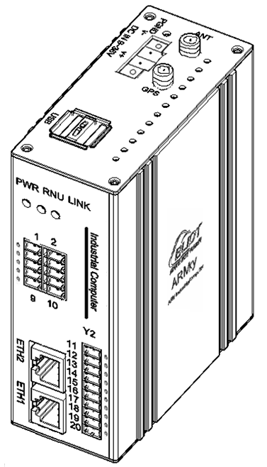

 ARM工业计算机控制器技术规格书

ARMxy BL335系列技术规格书

|     |     |     |     |     |
|-----|-----|-----|-----|-----|
|     |     |     |     |     |
|     |     |     |     |     |

版本说明

<table>
<colgroup>
<col style="width: 18%" />
<col style="width: 19%" />
<col style="width: 18%" />
<col style="width: 43%" />
</colgroup>
<tbody>
<tr>
<td style="text-align: center;">修改人</td>
<td style="text-align: center;">版本</td>
<td style="text-align: center;">日期</td>
<td style="text-align: center;">修改内容</td>
</tr>
<tr>
<td style="text-align: left;">Panghao</td>
<td style="text-align: center;">V1.0</td>
<td style="text-align: center;">2025-03-04</td>
<td style="text-align: center;">初次发布</td>
</tr>
<tr>
<td style="text-align: left;">Panghao</td>
<td style="text-align: center;">V1.1</td>
<td style="text-align: center;">2026-07-15</td>
<td style="text-align: center;"><ol type="1">
<li>
修改公司地址
</li>
<li>
新增复位按键自定义说明
</li>
<li>
新增codesys版本说明
</li>
</ol></td>
</tr>
</tbody>
</table>

# 一、产品概述

BL335是一款可灵活配置IO口，实现各类控制功能的、100%国产化的工业级ARMxy系列嵌入式计算机。该嵌入式计算机采用了高性能、高性价比的全志科技T113-i芯片作为核心，以及根据不同需求可以配置不同大小的RAM和ROM，配合钡铼特指的X板模块和Y板模块，可以完成各类复杂场景的工作。丰富的外部硬件接口搭配多样化的软件和高效的操作系统，在使用上更得心应手，可以轻松应用于智能物联网关、工业边缘计算、工业控制、充电桩与智能终端等。

**BL335的7大特点：**

1.  **丰富的接口配置：**

- 提供2个100Mhz网口，支持高速网络通信。

- 配备2个USB2.0接口，方便外接设备。

- 可选配X系列和Y系列IO板，支持PWM输出、脉冲计数等数据采集与控制功能，拥有4000多种模块组合选项，并且可以自由更换。

- 内置Mini PCIE接口，支持蓝牙、WiFi、4G模块通信，增强无线连接能力。

2.  **多操作系统支持：**

- 支持Linux-5.4.61、Linux-RT-5.4.61内核以及Ubuntu20.04等操作系统。

- 高扩展性的系统设计，能够处理复杂的操作任务，并优化设备间的数据传输。

3.  **Node-Red图形界面开发工具：**

- 钡铼技术首创自带Node-Red图形界面开发工具，提供图形化配置界面和直观的功能图标，降低使用门槛，使非专业人员也能轻松上手。

4.  **自研工业协议转换软件：**

- 钡铼技术自主研发的BLIoTLink工业协议转换软件，能够快速接入各种主流物联网云平台和工业组态软件SCADA，实现高效的数据采集与转换。

5.  **BLRAT远程访问工具：**

- 通过BLRAT远程访问工具，实现远程访问与运维，支持无人化工作环境，提升维护效率和用户体验。

6.  **专业的电气性能设计和广泛的应用领域：**

- 经过专业的电气性能设计，并通过高压静电测试、浪涌测试、高低温测试验证，确保系统稳定可靠。

- 配备DIN35导轨安装，适应各种工业应用环境。

- 广泛应用于工业物联网、光伏发电与储能系统、自动化控制、交通轨道、PLC控制扩展、云端数据采集、辅助监管生产、多点数据采集等领域。

7.  **支持“所述即所得”的编程方式：**

- 预装BLRAT远程访问工具实现远程访问与运维；预装QuickConfig快速配置工具，可以远程快速配置和调试设备，高工作效率；支持Node-Red可以快速实现物联网应用等，此外还可以通过AI辅助编写应用程序。

BL335凭借其高性能、高可靠性和丰富的功能配置，能够满足多种复杂工业场景的需求，是一款理想的工业级嵌入式计算机解决方案。

# 二、典型应用领域

✓ 工业控制 ✓ 光伏发电 ✓ 数据采集器

✓ 边缘计算 ✓ 智能设备 ✓ 轨道交通

✓ 储能系统 ✓ 物联网关

# 三、软硬件参数

***无Y板的产品外观结构： 1块Y板的产品外观结构： 2块Y板的产品外观结构：***

## 硬件参数

<table>
<colgroup>
<col style="width: 19%" />
<col style="width: 9%" />
<col style="width: 71%" />
</colgroup>
<tbody>
<tr>
<td rowspan="6" style="text-align: center;"><strong>CPU</strong></td>
<td colspan="2">全志科技 T113-i，22nm，2x ARM Cortex-A7，主频高达 1.2GHz</td>
</tr>
<tr>
<td colspan="2">2x ARM Cortex-A7，主频高达 1.2GHz</td>
</tr>
<tr>
<td colspan="2">1x HiFi4 DSP，主频高达 600MHz</td>
</tr>
<tr>
<td colspan="2">1x 玄铁 C906 RISC-V(64bit)，主频高达 1008MHz</td>
</tr>
<tr>
<td style="text-align: center;">Encoder</td>
<td>JPEG/MJPEG up to 1080p@60fps</td>
</tr>
<tr>
<td style="text-align: center;">Decoder</td>
<td>
H.265 MP@L5.0 支持最高 4K@30fps

H.264 BP/MP/HP@L5.0 支持最高 4K@24fps

MPEG-4 SP/ASP L5.0 支持最高 1080p@60fps

MPEG-2/MPEG-1 MP/HL 支持最高 1080p@60fps

JPEG/Xvid/Sorenson Spark 支持最高 1080p@60fps

MJPEG 支持最高 1080p@30fps
</td>
</tr>
<tr>
<td style="text-align: center;"><strong>ROM</strong></td>
<td colspan="2">4/8GByte eMMC</td>
</tr>
<tr>
<td style="text-align: center;"><strong>RAM</strong></td>
<td colspan="2">512M/1GByte DDR3</td>
</tr>
<tr>
<td style="text-align: center;"><strong>ETH</strong></td>
<td colspan="2">RJ-45 接口，2x100Mbps，ESD 3级，EFT 3级</td>
</tr>
<tr>
<td style="text-align: center;"><strong>USB</strong></td>
<td colspan="2">2x USB2.0 HOST(USB1、USB2)，支持高速480Mbps、全速12Mbps和 低速1.5Mbps模式，ESD 3级</td>
</tr>
<tr>
<td style="text-align: center;"><strong>IO槽</strong></td>
<td colspan="2">
X系列IO板槽：1个，可选X系列IO板，支持RS485、RS232、DI、DO、GPIO等；

Y系列IO板槽：2个，可选Y系列IO板，支持RS485、RS232、DI、DO、继电器输出模块、AI、AO、PT100、PT1000、热电偶等。
</td>
</tr>
<tr>
<td rowspan="2" style="text-align: center;"><strong>LED</strong></td>
<td colspan="2">1x 电源指示灯</td>
</tr>
<tr>
<td colspan="2">2x 用户可编程指示灯</td>
</tr>
<tr>
<td style="text-align: center;"><strong>Mini PCIE</strong></td>
<td colspan="2">1个，WiFi、4G模块等</td>
</tr>
<tr>
<td style="text-align: center;"><strong>SIMCard槽</strong></td>
<td colspan="2">1个，NANO</td>
</tr>
<tr>
<td style="text-align: center;"><strong>天线接口</strong></td>
<td colspan="2">2个，可用于4G/WIFI/GPS等</td>
</tr>
<tr>
<td style="text-align: center;"><strong>Debug</strong></td>
<td colspan="2">1个Micro USB调试口</td>
</tr>
<tr>
<td style="text-align: center;"><strong>SD卡槽</strong></td>
<td colspan="2">1个</td>
</tr>
<tr>
<td style="text-align: center;"><strong>复位按键</strong></td>
<td colspan="2">1个复位按键，支持自定义功能（购买前说清楚用途）</td>
</tr>
<tr>
<td style="text-align: center;"><strong>独立看门狗</strong></td>
<td colspan="2">板载独立硬件看门狗</td>
</tr>
<tr>
<td style="text-align: center;"><strong>电源</strong></td>
<td colspan="2">额定DC 24V，支持宽电压12-24VDC，具备反接保护，过流保护。2PIN带螺钉端子。</td>
</tr>
<tr>
<td style="text-align: center;"><strong>接地</strong></td>
<td colspan="2">外壳接地</td>
</tr>
<tr>
<td style="text-align: center;"><strong>安装方式</strong></td>
<td colspan="2">DIN35导轨安装、墙面固定安装</td>
</tr>
<tr>
<td style="text-align: center;"><strong>材质</strong></td>
<td colspan="2">铝合金外壳+不锈钢</td>
</tr>
<tr>
<td style="text-align: center;"><strong>尺寸</strong></td>
<td colspan="2">110*83*46mm（公差0.5mm）</td>
</tr>
</tbody>
</table>

## 软件参数

|              |                               |
|:------------:|-------------------------------|
|   **内核**   | Linux-5.4.61、Linux-RT-5.4.61 |
| **文件系统** | Buildroot-201902、Ubuntu20.04 |
|              |                               |
|              |                               |
|              |                               |

## 软件生态

| **软件名称** | **类型** | **核心功能** | **主要应用场景** |
|:--:|:---|:---|:---|
| **BLIoTLink** | 自研 | 工业协议采集与转换（Modbus、BACnet、DLT645、IEC104等），对接云平台与SCADA | 楼宇自动化、工厂监控、智慧水务 |
| **Node-RED** | 开源 | 可视化流编程，拖拽构建物联网逻辑流（HTTP、MQTT、数据库等） | 边缘计算、多协议融合、自定义规则引擎 |
| **QuickConfig** | 自研 | 图形化一站式配置管理，含网络切换、系统监控、AI代码助手、远程运维 | 网关部署与运维、开发辅助 |
| **BLRAT** | 自研 | 免费远程访问工具，三步连接，多设备兼容 | 设备远程运维与访问 |
| **NEXPLC** | 自研 | 工业4.0软PLC，支持标准化编程、多语言、云对接 | 工业/楼宇/能源自动化控制 |
| **OpenPLC** | 开源 | IEC 61131-3标准软PLC，支持梯形图等5种语言 | 小型设备本地控制、安全联锁、边缘逻辑执行 |
| **FUXA** | 开源 | 基于Web的SCADA/HMI，拖拽式监控画面，支持Modbus/OPC UA/MQTT | 产线监控大屏、智慧水务、能源管理驾驶舱 |
| **Ignition** | 开源 | 集成SCADA、MES、IIoT的工业自动化平台，Web架构无客户端限制 | 工厂级中央监控与数据平台 |
| **Thingsboard IoT Gateway** | 开源 | 非IP设备（Modbus/CAN等）转MQTT/HTTP，对接Thingsboard平台 | 物联网数据采集与云桥接 |
| **Grafana** | 开源 | 时序数据可视化与分析，近百种数据源，丰富仪表盘 | 数据分析与运维监控驾驶舱 |
| **Vnode** | 开源 | 轻量级边缘计算/函数运行时，优化嵌入式环境 | 数据预处理、Node-RED补充/替代 |
| **Docker** | 开源 | 应用容器化，一键部署、隔离运行、统一管理 | 边缘多应用部署与运维 |
| **YOLOv5/8** | 开源 | 实时目标检测算法，支持自定义训练，适配边缘推理 | 工业质检、安全生产（安全帽/入侵识别）、仪表读数 |
| **OpenCV** | 开源 | 计算机视觉基础库（图像处理、特征检测、校准等） | 视觉类方案的底层算法支撑 |
| **其他** | \- | Python、C#、MySQL、SQLite等常用开发与数据组件 | 各类应用开发与数据存储 |

# 四、产品选型

> ARMxy系列ARM嵌入式控制器采用灵活的设计理念，可以根据需要灵活选择不同的SOM板实现不同的ROM与RAM的组合，采用不同的X板、Y板实现丰富的IO组合，满足各种应用场景的需求。
>
> 产品命名规则为：
>
> 主机型号-SOM型号-X板型号-Y1板型号-Y2板型号-codesys版本
>
> 比如：BL335-SOM336-X1-Pro-CR
>
> 其中BL335表示2个以太网口、2个USB2.0、X板为2x5PIN、无Y板；SOM336表示eMMC为4GByte，DDR4为256MByte，宽温级 -20~70℃；X1表示X板上的功能为4路RS485，-Pro-CR指带CNC+Robotics 高级运动控制功能。
>
> 如需增加WIFI，则在主型号后面加W表示，如BL335W-SOM336-X1;
>
> 如需增加4G模块，则在主型号后面加L表示，如BL335L-SOM336-X1。

**ARMxy BL335系列选型表**

|  |  |  |  |  |  |  |
|:--:|:--:|:--:|:--:|:--:|:--:|:--:|
| **型号** | **ETH** | **USB** | **HDMI** | **X 板IO槽** | **Y板IO槽** | **尺寸** |
| BL335 | 1x1000Mhz，1x100Mhz | 2xUSB2.0 | X | 2x5PIN | X | 110\*83\*46mm |
| BL335A | 1x1000Mhz，1x100Mhz | 2xUSB2.0 | X | 2x5PIN | 1 | 110\*83\*46mm |
| BL335B | 1x1000Mhz，1x100Mhz | 2xUSB2.0 | X | 2x5PIN | 2 | 110\*83\*46mm |

**ARMxy BL335系列SOM选型表**

可以根据需求，选择合适的ROM、RAM以及温度等级。

|  |  |  |  |  |  |  |  |
|:--:|:--:|:--:|:--:|:--:|:--:|:--:|:--:|
| **型号** | **MCU** | **主频** | **内核** | **Nand Flash** | **eMMC** | **DDR3** | **温度级别** |
| SOM332 | T113-i | 1.2GHz | 2 x A7 | / | 4GByte | 256MByte | 工业级 -40~85℃ |
| SOM333 | T113-i | 1.2GHz | 2 x A7 | / | 4GByte | 512MByte | 工业级 -40~85℃ |
| SOM334 | T113-i | 1.2GHz | 2 x A7 | / | 8GByte | 512MByte | 工业级 -40~85℃ |
| SOM335 | T113-i | 1.2GHz | 2 x A7 | / | 8GByte | 1GByte | 工业级 -40~85℃ |
| SOM336 | T113-i | 1.2GHz | 2 x A7 | / | 4GByte | 256MByte | 宽温级 -20~70℃ |

**X系列IO板选型表**

可以根据需求，选择合适的X系列IO板。

<table>
<colgroup>
<col style="width: 26%" />
<col style="width: 14%" />
<col style="width: 14%" />
<col style="width: 14%" />
<col style="width: 14%" />
<col style="width: 14%" />
</colgroup>
<tbody>
<tr>
<td style="text-align: center;">型号</td>
<td style="text-align: center;">RS485</td>
<td style="text-align: center;">RS232</td>
<td style="text-align: center;">CAN</td>
<td style="text-align: center;">GPIO</td>
<td style="text-align: center;">PIN数</td>
</tr>
<tr>
<td style="text-align: center;">X0</td>
<td style="text-align: center;">x</td>
<td style="text-align: center;">x</td>
<td style="text-align: center;">x</td>
<td style="text-align: center;">8</td>
<td style="text-align: center;">2x5PIN</td>
</tr>
<tr>
<td style="text-align: center;">X1</td>
<td style="text-align: center;">4</td>
<td style="text-align: center;">x</td>
<td style="text-align: center;">x</td>
<td style="text-align: center;">x</td>
<td style="text-align: center;">2x5PIN</td>
</tr>
<tr>
<td style="text-align: center;">X2</td>
<td style="text-align: center;">x</td>
<td style="text-align: center;">4</td>
<td style="text-align: center;">x</td>
<td style="text-align: center;">x</td>
<td style="text-align: center;">2x5PIN</td>
</tr>
<tr>
<td style="text-align: center;">X3</td>
<td style="text-align: center;">2</td>
<td style="text-align: center;">2</td>
<td style="text-align: center;">x</td>
<td style="text-align: center;">x</td>
<td style="text-align: center;">2x5PIN</td>
</tr>
<tr>
<td style="text-align: center;">X4</td>
<td style="text-align: center;">2</td>
<td style="text-align: center;"><blockquote>

x

</blockquote></td>
<td style="text-align: center;"><blockquote>

2

</blockquote></td>
<td style="text-align: center;">x</td>
<td style="text-align: center;">2x5PIN</td>
</tr>
<tr>
<td style="text-align: center;">X5</td>
<td style="text-align: center;">x</td>
<td style="text-align: center;">2</td>
<td style="text-align: center;">2</td>
<td style="text-align: center;">x</td>
<td style="text-align: center;">2x5PIN</td>
</tr>
<tr>
<td style="text-align: center;">X6</td>
<td style="text-align: center;">2</td>
<td style="text-align: center;">x</td>
<td style="text-align: center;">x</td>
<td style="text-align: center;">4</td>
<td style="text-align: center;">2x5PIN</td>
</tr>
<tr>
<td style="text-align: center;">X7</td>
<td style="text-align: center;">x</td>
<td style="text-align: center;">2</td>
<td style="text-align: center;">x</td>
<td style="text-align: center;">4</td>
<td style="text-align: center;">2x5PIN</td>
</tr>
<tr>
<td style="text-align: center;">X8</td>
<td style="text-align: center;">1</td>
<td style="text-align: center;">1</td>
<td style="text-align: center;">1</td>
<td style="text-align: center;">2</td>
<td style="text-align: center;">2x5PIN</td>
</tr>
<tr>
<td style="text-align: center;">X9</td>
<td style="text-align: center;">x</td>
<td style="text-align: center;">x</td>
<td style="text-align: center;">x</td>
<td style="text-align: center;">4DI+4DO</td>
<td style="text-align: center;">2x5PIN</td>
</tr>
</tbody>
</table>

**\**

**Y系列IO板选型表**

可以根据需求，选择合适的Y系列IO板，Y系列IO模块适用于所有Y槽。

<table style="width:100%;">
<colgroup>
<col style="width: 10%" />
<col style="width: 33%" />
<col style="width: 10%" />
<col style="width: 11%" />
<col style="width: 33%" />
</colgroup>
<tbody>
<tr>
<td style="text-align: center;"><strong>型号</strong></td>
<td style="text-align: center;"><strong>描述</strong></td>
<td rowspan="14" style="text-align: center;"></td>
<td style="text-align: center;"><strong>型号</strong></td>
<td style="text-align: center;"><strong>描述</strong></td>
</tr>
<tr>
<td style="text-align: center;">Y01</td>
<td style="text-align: center;">4DI+4DO模块 NPN</td>
<td style="text-align: center;">Y41</td>
<td style="text-align: center;">4路AO模块输出 0/4~20mA</td>
</tr>
<tr>
<td style="text-align: center;">Y02</td>
<td style="text-align: center;">4DI+4DO模块 PNP</td>
<td style="text-align: center;">Y43</td>
<td style="text-align: center;">4路AO模块输出 0~5/10V</td>
</tr>
<tr>
<td style="text-align: center;">Y03</td>
<td style="text-align: center;">4DI+4DO模块继电器【预留】</td>
<td style="text-align: center;">Y46</td>
<td style="text-align: center;">4路AO模块输出 ±5V/±10V</td>
</tr>
<tr>
<td style="text-align: center;">Y11</td>
<td style="text-align: center;">8路DI模块NPN</td>
<td style="text-align: center;">Y51</td>
<td style="text-align: center;">2路RTD模块三线PT100</td>
</tr>
<tr>
<td style="text-align: center;">Y12</td>
<td style="text-align: center;">8路DI模块PNP</td>
<td style="text-align: center;">Y52</td>
<td style="text-align: center;">2路RTD模块三线PT1000</td>
</tr>
<tr>
<td style="text-align: center;">Y21</td>
<td style="text-align: center;">8路DO模块PNP</td>
<td style="text-align: center;">Y53</td>
<td style="text-align: center;">2路RTD模块四线PT100</td>
</tr>
<tr>
<td style="text-align: center;">Y22</td>
<td style="text-align: center;">8路DO模块NPN</td>
<td style="text-align: center;">Y54</td>
<td style="text-align: center;">2路RTD模块四线PT1000</td>
</tr>
<tr>
<td style="text-align: center;">Y24</td>
<td style="text-align: center;">4路DO模块继电器</td>
<td style="text-align: center;"><del>Y56</del></td>
<td style="text-align: center;"><del>电阻测量</del></td>
</tr>
<tr>
<td style="text-align: center;">Y31</td>
<td style="text-align: center;">4路AI模块单端输入 0/4~20mA</td>
<td style="text-align: center;"><del>Y57</del></td>
<td style="text-align: center;"><del>电压测量</del></td>
</tr>
<tr>
<td style="text-align: center;">Y33</td>
<td style="text-align: center;">4路AI模块单端输入 0~5/10V</td>
<td style="text-align: center;">Y58</td>
<td style="text-align: center;">4路TC模块</td>
</tr>
<tr>
<td style="text-align: center;">Y34</td>
<td style="text-align: center;">4路AI模块差分输入 0~5/10V</td>
<td style="text-align: center;">Y63</td>
<td style="text-align: center;">4路RS485/RS232可选模块</td>
</tr>
<tr>
<td style="text-align: center;">Y36</td>
<td style="text-align: center;">4路AI模块差分输入 ±5V/±10V</td>
<td style="text-align: center;">Y95</td>
<td style="text-align: center;">4路PWM输出+4路脉冲计数（1路高速3路低速），NPN</td>
</tr>
<tr>
<td style="text-align: center;"><del>Y37</del></td>
<td style="text-align: center;"><del>4路IEPE测量模块</del></td>
<td style="text-align: center;">Y96</td>
<td style="text-align: center;">4路PWM输出+4路脉冲计数（1路高速3路低速）,PNP</td>
</tr>
</tbody>
</table>

**codesys版本**

<table>
<colgroup>
<col style="width: 21%" />
<col style="width: 78%" />
</colgroup>
<tbody>
<tr>
<td style="text-align: center;"><strong>版本号</strong></td>
<td style="text-align: center;"><strong>功能</strong></td>
</tr>
<tr>
<td style="text-align: center;">无</td>
<td style="text-align: center;">不带codesys功能</td>
</tr>
<tr>
<td style="text-align: center;">Pro</td>
<td style="text-align: center;">
(专业版)搭载 CODESYS，可选择运动控制授权(仅Pro版本可选):

无后缀:CODESYS 基础版，不带运动控制

-SM:带基本运动控制功能

-CR:带CNC+Robotics 高级运动控制功能
</td>
</tr>
</tbody>
</table>

# 五、电磁兼容性测试

<table>
<colgroup>
<col style="width: 10%" />
<col style="width: 17%" />
<col style="width: 15%" />
<col style="width: 11%" />
<col style="width: 21%" />
<col style="width: 7%" />
<col style="width: 16%" />
</colgroup>
<tbody>
<tr>
<td style="text-align: center;"><strong>测试类别</strong></td>
<td style="text-align: center;"><strong>测试项目</strong></td>
<td style="text-align: center;"><strong>测试标准</strong></td>
<td style="text-align: center;"><strong>测试等级</strong></td>
<td style="text-align: center;"><strong>测试条件</strong></td>
<td style="text-align: center;"><strong>测试结果</strong></td>
<td style="text-align: center;"><strong>备注</strong></td>
</tr>
<tr>
<td rowspan="2" style="text-align: center;"><strong>电磁发射</strong></td>
<td style="text-align: center;">传导发射</td>
<td style="text-align: center;">
GB/T 9254 Class A/

CISPR 32 Class A
</td>
<td style="text-align: center;">Class A</td>
<td style="text-align: center;">150 kHz - 30 MHz</td>
<td style="text-align: center;">合格</td>
<td style="text-align: center;">满足普通工业环境限值要求</td>
</tr>
<tr>
<td style="text-align: center;">辐射发射</td>
<td style="text-align: center;">
GB/T 9254 Class A/

CISPR 32 Class A
</td>
<td style="text-align: center;">Class A</td>
<td style="text-align: center;">30 MHz - 1 GHz</td>
<td style="text-align: center;">合格</td>
<td style="text-align: center;">满足普通工业环境限值要求</td>
</tr>
<tr>
<td rowspan="6" style="text-align: center;"><strong>抗扰度测试</strong></td>
<td style="text-align: center;">静电放电（ESD）</td>
<td style="text-align: center;">GB/T 17626.2/IEC 61000-4-2</td>
<td style="text-align: center;">III 级</td>
<td style="text-align: center;">
接触放电 +/-4 kV

空气放电 +/-8 kV
</td>
<td style="text-align: center;">合格</td>
<td style="text-align: center;">—</td>
</tr>
<tr>
<td style="text-align: center;">射频辐射抗扰度</td>
<td style="text-align: center;">
GB/T 17626.3/

IEC 61000-4-3
</td>
<td style="text-align: center;">III 级</td>
<td style="text-align: center;">
场强 10 V/m，

80 MHz - 1 GHz
</td>
<td style="text-align: center;">合格</td>
<td style="text-align: center;">—</td>
</tr>
<tr>
<td style="text-align: center;">电快速瞬变脉冲群（EFT）</td>
<td style="text-align: center;">GB/T 17626.4/ IEC 61000-4-4</td>
<td style="text-align: center;">III 级</td>
<td style="text-align: center;">
电源线 2 kV

信号线 1 kV
</td>
<td style="text-align: center;">合格</td>
<td style="text-align: center;">—</td>
</tr>
<tr>
<td style="text-align: center;">浪涌（Surge）</td>
<td style="text-align: center;">GB/T 17626.5/ IEC 61000-4-5</td>
<td style="text-align: center;">III 级</td>
<td style="text-align: center;">
差模 2 kV

共模 4 kV
</td>
<td style="text-align: center;">合格</td>
<td style="text-align: center;">—</td>
</tr>
<tr>
<td style="text-align: center;">电压暂降和中断</td>
<td style="text-align: center;">GB/T 17626.11/ IEC 61000-4-11</td>
<td style="text-align: center;">III 级</td>
<td style="text-align: center;">
电压暂降70%

持续500ms，

完全中断10 ms
</td>
<td style="text-align: center;">合格</td>
<td style="text-align: center;">—</td>
</tr>
<tr>
<td style="text-align: center;">工频磁场抗扰度</td>
<td style="text-align: center;">GB/T 17626.8/ IEC 61000-4-8</td>
<td style="text-align: center;">III 级</td>
<td style="text-align: center;">
测试强度30 A/m

工频50 Hz
</td>
<td style="text-align: center;">合格</td>
<td style="text-align: center;">—</td>
</tr>
</tbody>
</table>

测试结论

本边缘网关设备在普通工业环境的电磁兼容性测试中完全符合GB/T系列标准与对应IEC标准的要求，具备良好的电磁兼容性能，可在工业现场稳定运行。

# 六、环境适应性测试

<table>
<colgroup>
<col style="width: 20%" />
<col style="width: 19%" />
<col style="width: 10%" />
<col style="width: 23%" />
<col style="width: 10%" />
<col style="width: 16%" />
</colgroup>
<tbody>
<tr>
<td style="text-align: center;"><strong>测试项目</strong></td>
<td style="text-align: center;"><strong>测试标准</strong></td>
<td style="text-align: center;"><strong>等级要求</strong></td>
<td style="text-align: center;"><strong>测试条件</strong></td>
<td style="text-align: center;"><strong>测试结果</strong></td>
<td style="text-align: center;"><strong>备注</strong></td>
</tr>
<tr>
<td style="text-align: center;"><strong>低温启动与运行试验</strong></td>
<td style="text-align: center;">GB/T 2423.1-2008/IEC 60068-2-1</td>
<td style="text-align: center;">N/A</td>
<td style="text-align: center;">
环境温度 -40℃ 下，

设备启动并正常运行
</td>
<td style="text-align: center;">符合要求</td>
<td style="text-align: center;">满足工业环境基本低温启动需求。</td>
</tr>
<tr>
<td style="text-align: center;"><strong>高温启动与运行试验</strong></td>
<td style="text-align: center;">GB/T 2423.2-2008/IEC 60068-2-2</td>
<td style="text-align: center;">N/A</td>
<td style="text-align: center;">
环境温度 +85℃ 下，

设备启动并正常运行
</td>
<td style="text-align: center;">符合要求</td>
<td style="text-align: center;">满足工业环境基本高温启动需求。</td>
</tr>
<tr>
<td style="text-align: center;"><strong>恒定湿热试验</strong></td>
<td style="text-align: center;">GB/T 2423.3-2016/IEC 60068-2-78</td>
<td style="text-align: center;">N/A</td>
<td style="text-align: center;">
环境温度 +40℃，相对湿度 85%，

通电运行 48 小时
</td>
<td style="text-align: center;">符合要求</td>
<td style="text-align: center;">确保设备在潮湿环境中运行稳定。</td>
</tr>
<tr>
<td style="text-align: center;"><strong>正弦振动试验</strong></td>
<td style="text-align: center;">GB/T 2423.10-2019/IEC 60068-2-6</td>
<td style="text-align: center;">N/A</td>
<td style="text-align: center;">频率范围5 Hz至500 Hz，加速度2g，三个轴向各10次循环</td>
<td style="text-align: center;">符合要求</td>
<td style="text-align: center;">验证设备在运输和安装过程中的抗振能力。</td>
</tr>
<tr>
<td style="text-align: center;"><strong>自由跌落试验</strong></td>
<td style="text-align: center;">GB/T 2423.7-2018/IEC 60068-2-31</td>
<td style="text-align: center;">N/A</td>
<td style="text-align: center;">带包装状态下，从0.8米高度自由跌落，6 个面各跌落 1 次</td>
<td style="text-align: center;">符合要求</td>
<td style="text-align: center;">确保设备在运输过程中的抗冲击能力。</td>
</tr>
<tr>
<td style="text-align: center;"><strong>防护等级测试</strong></td>
<td style="text-align: center;">GB/T 4208-2017/IEC 60529</td>
<td style="text-align: center;">IP30</td>
<td style="text-align: center;">防尘性能：防止2.5mm直径和更大的固体外来体探测器进入；</td>
<td style="text-align: center;">符合要求</td>
<td style="text-align: center;">满足工业环境的防护要求。</td>
</tr>
</tbody>
</table>

# 七、出货包装

ARM嵌入式控制器一台

DIN35安装支架一套

BLIoTLink软件预装

BLRAT软件预装

Ubuntu文件系统

免压接端子按照选购配件配置

当选购了WIFI、4G模块时，则会附带WIFI、4G模块天线。

# 八、技术支持&服务

✓提供系统固化镜像、文件系统镜像、内核驱动源码，以及丰富的 Demo 程序；

✓提供完整的平台开发包、入门教程，节省软件整理时间，让应用开发更简单；

✓提供丰富的开发案例供参考，让应用开发更简单，主要包括：

➢ Linux、Linux-RT 应用开发案例

➢ BLIoTLink工业协议采集与接入云平台开发案例；

➢ BLRAT远程访问使用案例；

➢ Node-Red物联网应用开发案例

➢ Docker 容器技术、MQTT 通信协议案例

➢ Ubuntu 操作系统演示案例

➢ IgH EtherCAT 主站、CAN 开发案例

➢ 4G/WIFI 开发案例

✓协助进行产品二次开发；

✓定制研发与生产；

✓提供长期的售后服务。

深圳市钡铼技术有限公司

官网：https://www.bliiot.cn
