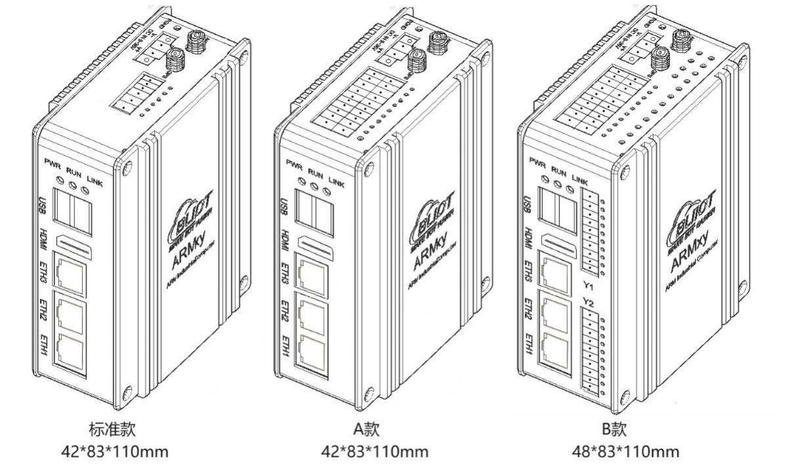
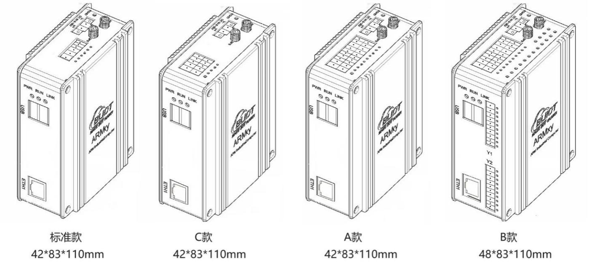
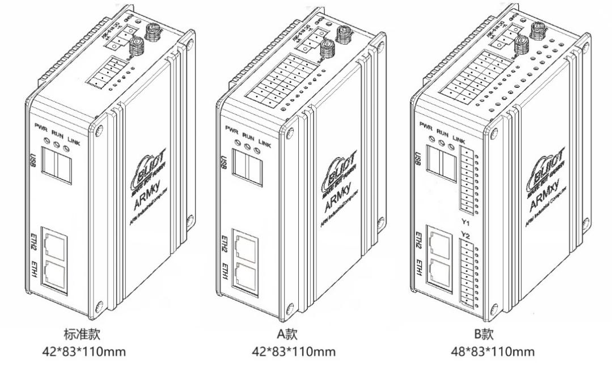
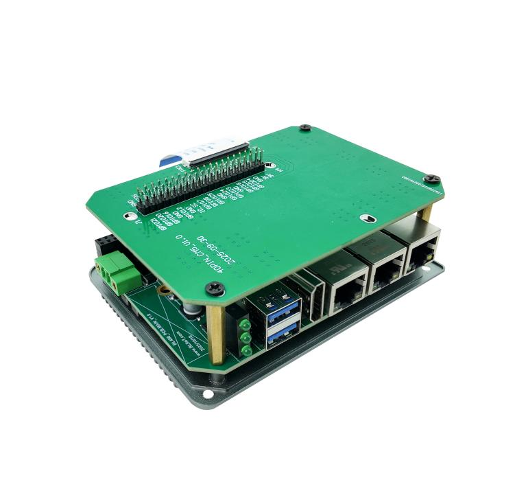
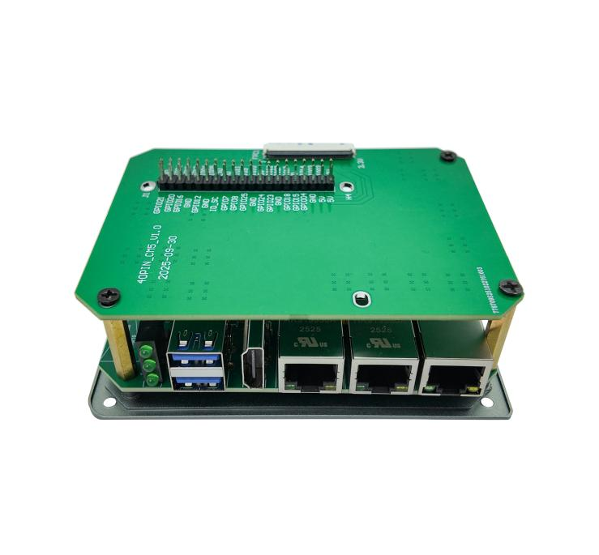

ARM工业计算机控制器技术规格书

ARMxy BL460系列技术规格书

|     |     |     |     |     |     |
|:---:|:---:|:----|:---:|:---:|:---:|
|     |     |     |     |     |     |
|     |     |     |     |     |     |
|     |     |     |     |     |     |

版本说明

<table>
<colgroup>
<col style="width: 18%" />
<col style="width: 19%" />
<col style="width: 18%" />
<col style="width: 43%" />
</colgroup>
<tbody>
<tr>
<td style="text-align: center;">修改人</td>
<td style="text-align: center;">版本</td>
<td style="text-align: center;">日期</td>
<td style="text-align: center;">修改内容</td>
</tr>
<tr>
<td style="text-align: left;"><blockquote>

Panghao

</blockquote></td>
<td style="text-align: center;">V1.0</td>
<td style="text-align: center;">2025-10-09</td>
<td style="text-align: center;">初次发布</td>
</tr>
<tr>
<td style="text-align: center;">Panghao</td>
<td style="text-align: center;">V1.1</td>
<td style="text-align: center;">2026-07-15</td>
<td style="text-align: center;"><ol type="1">
<li>
修改公司地址
</li>
<li>
新增复位按键自定义说明
</li>
<li>
新增codesys版本说明
</li>
</ol></td>
</tr>
</tbody>
</table>

# 目录

一、 产品概述 2

二、 典型应用领域 2

三、 软硬件参数 2

四、 产品选型 6

五、 电磁兼容性测试 9

六、 环境适应性测试 9

七、 出货包装 10

八、 技术支持&服务 10

1.  产品概述

ARMxy系列的ARM嵌入式计算机BL460系列是一款可灵活配置IO口的工业级ARM控制器，基于Broadcom BCM2712处理器设计的四核ARM Cortex-A76内核，主频高达2.4GHz，搭载8/16/32/64GByte eMMC，2/4/8/16GByte LPDDR4X多种组合的ROM与RAM，支持丰富的IO接口。BL460系列广泛应用于工业控制、边缘计算、通讯管理机、工业物联网关、储能系统、自动化控制、智能制造、智能设备、轨道交通等领域。

BL460系列ARM嵌入式计算机提供1~3个可选的RJ-45网口，1x10/100/1000M和2x10/100M自适应网口、2xUSB3.0、1个可选的HDMI2.1、1个可选的X系列IO板，2个可选的Y系列IO板等丰富的接口，可用作通讯、PWM输出、脉冲计数等数据采集与控制。核心板内置专为Raspberry Pi 5设计的I/O控制器芯片RP1和芯片组电源管理芯片 DA9091，支持 OpenGL ES 3.1、Vulkan 1.2、4Kp60 HEVC 解码器。可选配自带WiFi蓝牙模块的核心板。主板内置M.2 接口，支持B key和B&M key接口的固态硬盘，内置Mini PCIE接口，支持4G、5G模块通信。兼容树莓派软硬件生态，预留40pin拓展板接口，可选配40pin拓展板，拥有丰富的GPIO引脚排针，能外接各种外设，使用各种基于树莓派设计的扩展模块，如AIkit模块等，方便用户进行二次开发。

BL460系列ARM嵌入式计算机支持Linux 6.6.78-v8-16k内核、Raspberry Pi OS等操作系统、Docker容器、Node-Red以及Qt-5.15.11等图形界面开发工具。Raspberry Pi OS系统不仅提供了一个对用户友好的桌面环境,还针对树莓派独特的 ARM 架构和硬件特性进行了深度优化和功能扩展，支持包括Python在内的多种编程语言。支持多种操作系统，提升跨平台开发能力。支持BLIoTLink工业协议转换软件用于工业数据采集与转换，快速接入各种主流物联网云平台与工业组态软件SCADA等，通过BLRAT远程访问工具实现远程访问与运维。可选预装QuickConfig快速配置工具，通过直观的操作界面远程快速配置和调试设备，提高工作效率；支持Node-Red可以快速实现物联网应用等。

BL460系列ARM嵌入式计算机经过专业的电气性能设计和高低温测试验证，可稳定可靠地工作在恶劣的电磁干扰与 -20~85℃温度下，DIN35导轨安装，可满足各种工业应用环境。

2.  典型应用领域

✓ 工业控制 ✓ 储能系统EMS/BMS

✓ 工业 PLC ✓ 运动控制器

✓ 边缘计算网关 ✓ 汽车充电桩

✓ 血液分析仪 ✓ 智能制造

✓ 通讯管理机 ✓ AGV机器人

✓ 检测仪器设备 ✓ 工业机器人

✓ 轨道交通 ✓ 智能设备

3.  软硬件参数

<!-- -->

1.  外观尺寸

1个网口的产品外观结构与尺寸如下图：

2个网口的产品外观结构与尺寸如下图：

3个网口的产品外观结构与尺寸如下图：

2.  硬件参数

<table>
<colgroup>
<col style="width: 19%" />
<col style="width: 80%" />
</colgroup>
<tbody>
<tr>
<td rowspan="3">CPU</td>
<td>Broadcom BCM2712，16nm</td>
</tr>
<tr>
<td>4x Cortex-A76，主频：2.4GHz</td>
</tr>
<tr>
<td>GPU：VideoCore VII GPU，支持 OpenGL ES 3.1、Vulkan 1.2、4Kp60 HEVC 解码器</td>
</tr>
<tr>
<td>ROM</td>
<td>8/16/32/64GByte eMMC</td>
</tr>
<tr>
<td>RAM</td>
<td>2/4/8/16GByte LPDDR4X</td>
</tr>
<tr>
<td>ETH</td>
<td>RJ-45 接口1~3个，1个10/100/1000M、2个10/100M 自适应网口，ESD 3级，EFT 3级</td>
</tr>
<tr>
<td>USB</td>
<td>2x USB3.0，速率高达 5.0Gbps ，ESD 3级</td>
</tr>
<tr>
<td>HDMI</td>
<td>1x HDMI2.1，支持 4K@60fps</td>
</tr>
<tr>
<td>IO槽</td>
<td>
X系列IO板槽：1个，可选X系列IO板，支持RS485、RS232、DI、DO、GPIO等；

Y系列IO板槽：2个，可选Y系列IO板，支持RS485、RS232、DI、DO、继电器输出模块、AI、AO、PT100、PT1000、热电偶等。
</td>
</tr>
<tr>
<td rowspan="2">LED</td>
<td>1x 电源指示灯</td>
</tr>
<tr>
<td>2x 用户可编程指示灯</td>
</tr>
<tr>
<td>Mini PCIE</td>
<td>1个，支持蓝牙、WiFi、4G模块等</td>
</tr>
<tr>
<td>M.2</td>
<td>1个,支持2242尺寸固态硬盘</td>
</tr>
<tr>
<td>SIMCard槽</td>
<td>1个，NANO</td>
</tr>
<tr>
<td>天线接口</td>
<td>2个，用于4G/WIFI/GPS等</td>
</tr>
<tr>
<td>Debug</td>
<td>1个Micro USB调试口</td>
</tr>
<tr>
<td>SD卡槽</td>
<td>1个（仅用于Lite 版本的SOM）</td>
</tr>
<tr>
<td>复位按键</td>
<td>1个复位按键，支持自定义功能（购买前说清楚用途）</td>
</tr>
<tr>
<td>独立看门狗</td>
<td>板载独立硬件看门狗，开机自启动</td>
</tr>
<tr>
<td>电源</td>
<td>额定DC 24V，支持宽电压12-24VDC，具备反接保护，过流保护。2PIN带螺钉端子。</td>
</tr>
<tr>
<td>接地</td>
<td>1PIN接地连接点</td>
</tr>
<tr>
<td>安装方式</td>
<td>DIN35导轨安装、墙面固定安装</td>
</tr>
<tr>
<td>材质</td>
<td>铝合金外壳+不锈钢</td>
</tr>
<tr>
<td>尺寸</td>
<td>110*83*42mm或110*83*48mm</td>
</tr>
</tbody>
</table>

3.  软件参数

|                  |                              |
|------------------|------------------------------|
| 内核             | Linux 6.6.78-v8-16k          |
| 操作系统         | Raspberry Pi OS、Linux6.6.78 |
| 图形界面开发工具 | Qt-5.15.11                   |
|                  |                              |
|                  |                              |
|                  |                              |
|                  |                              |

4.  软件生态

| **软件名称** | **类型** | **核心功能** | **主要应用场景** |
|:--:|:---|:---|:---|
| **BLIoTLink** | 自研 | 工业协议采集与转换（Modbus、BACnet、DLT645、IEC104等），对接云平台与SCADA | 楼宇自动化、工厂监控、智慧水务 |
| **Node-RED** | 开源 | 可视化流编程，拖拽构建物联网逻辑流（HTTP、MQTT、数据库等） | 边缘计算、多协议融合、自定义规则引擎 |
| **QuickConfig** | 自研 | 图形化一站式配置管理，含网络切换、系统监控、AI代码助手、远程运维 | 网关部署与运维、开发辅助 |
| **BLRAT** | 自研 | 免费远程访问工具，三步连接，多设备兼容 | 设备远程运维与访问 |
| **NEXPLC** | 自研 | 工业4.0软PLC，支持标准化编程、多语言、云对接 | 工业/楼宇/能源自动化控制 |
| **OpenPLC** | 开源 | IEC 61131-3标准软PLC，支持梯形图等5种语言 | 小型设备本地控制、安全联锁、边缘逻辑执行 |
| **FUXA** | 开源 | 基于Web的SCADA/HMI，拖拽式监控画面，支持Modbus/OPC UA/MQTT | 产线监控大屏、智慧水务、能源管理驾驶舱 |
| **Ignition** | 开源 | 集成SCADA、MES、IIoT的工业自动化平台，Web架构无客户端限制 | 工厂级中央监控与数据平台 |
| **Thingsboard IoT Gateway** | 开源 | 非IP设备（Modbus/CAN等）转MQTT/HTTP，对接Thingsboard平台 | 物联网数据采集与云桥接 |
| **Grafana** | 开源 | 时序数据可视化与分析，近百种数据源，丰富仪表盘 | 数据分析与运维监控驾驶舱 |
| **Vnode** | 开源 | 轻量级边缘计算/函数运行时，优化嵌入式环境 | 数据预处理、Node-RED补充/替代 |
| **Docker** | 开源 | 应用容器化，一键部署、隔离运行、统一管理 | 边缘多应用部署与运维 |
| **YOLOv5/8** | 开源 | 实时目标检测算法，支持自定义训练，适配边缘推理 | 工业质检、安全生产（安全帽/入侵识别）、仪表读数 |
| **OpenCV** | 开源 | 计算机视觉基础库（图像处理、特征检测、校准等） | 视觉类方案的底层算法支撑 |
| **其他** | \- | Python、C#、MySQL、SQLite等常用开发与数据组件 | 各类应用开发与数据存储 |

5.  40pin拓展板

使用WiringPi硬件控制库可方便快捷直观的控制40pin引脚。

40pin拓展板使用预览图

注意：使用40pin拓展板时无法使用我司提供的设备外壳。GPIO14、15复用为主板Debug口，GPIO2、17分别复用为运行和网络指示灯，GPIO6、ID_SD复用到硬件看门狗，修改对应GPIO会使以上功能失效。不建议40pin拓展板与X板Y板共同使用。

与X板共用时：X板与40pin脚共用GPIO3、4、5、7、12、13、16、22、23、24、25、27，使用时会互相影响引脚状态。

与Y板共用时：slot1复用GPIO1、8、9、10、11、ID_SC，slot2复用GPIO0、18、19、20、21、26，修改以上GPIO会使与Y板连接失效。

4.  产品选型

ARMxy系列ARM嵌入式控制器采用灵活的设计理念，可以根据需要灵活选择不同的SOM板实现不同的ROM与RAM的组合，采用不同的X板、Y板实现丰富的I/O组合，满足各种应用场景的需求。

产品命名规则为：

主机型号-SOM型号-X板型号-Y1板型号-Y2板型号-codesys版本

比如：

BL461-SOM4612-X10-Pro-CR

表示2个以太网口，RAM为16GB LPDDR4X，ROM为32GB eMMC，4路RS485，-Pro-CR指带CNC+Robotics 高级运动控制功能。

如需增加4G模块，则在主型号后面加L表示，如BL461L-SOM4612-X10-Pro-CR。

**ARMxy BL460系列选型表**

|  |  |  |  |  |  |  |
|:--:|:--:|:--:|:--:|:--:|:--:|:--:|
| **型号** | **ETH** | **USB** | **HDMI** | **X 板IO槽** | **Y板IO槽** | **尺寸** |
| BL460 | 1x10/100/1000M | 2 | × | 1x6PIN | × | 42x83x110mm |
| BL460A | 1x10/100/1000M | 2 | × | 1x20PIN | × | 42x83x110mm |
| BL460B | 1x10/100/1000M | 2 | × | 1x20PIN | 2 | 48x83x110mm |
| BL460C | 1x10/100/1000M | 2 | × | 1x10PIN | × | 42x83x110mm |
| BL461 | 1x10/100/1000M，1x10/100M | 2 | × | 1x6PIN | × | 42x83x110mm |
| BL461A | 1x10/100/1000M，1x10/100M | 2 | × | 1x20PIN | × | 42x83x110mm |
| BL461B | 1x10/100/1000M，1x10/100M | 2 | × | 1x20PIN | 2 | 48x83x110mm |
| BL462 | 1x10/100/1000M，2x10/100M | 2 | 1 | 1x6PIN | × | 42x83x110mm |
| BL462A | 1x10/100/1000M，2x10/100M | 2 | 1 | 1x20PIN | × | 42x83x110mm |
| BL462B | 1x10/100/1000M，2x10/100M | 2 | 1 | 1x20PIN | 2 | 48x83x110mm |

可以根据需求，选择合适的ROM、RAM以及温度等级。

**ARMxy BL460系列SOM选型表**

|          |         |          |          |            |             |              |
|:--------:|:-------:|:--------:|:--------:|:----------:|:-----------:|:------------:|
| **型号** | **MCU** | **主频** | **无线** |  **eMMC**  | **LPDDR4X** | **温度级别** |
| SOM4601  | BCM2712 |  2.4GHz  |    x     | 0GB (Lite) |     2GB     |   -20~85℃    |
| SOM4602  | BCM2712 |  2.4GHz  |    x     |    16GB    |     2GB     |   -20~85℃    |
| SOM4603  | BCM2712 |  2.4GHz  |    x     |    32GB    |     2GB     |   -20~85℃    |
| SOM4604  | BCM2712 |  2.4GHz  |    x     | 0GB (Lite) |     4GB     |   -20~85℃    |
| SOM4605  | BCM2712 |  2.4GHz  |    x     |    16GB    |     4GB     |   -20~85℃    |
| SOM4606  | BCM2712 |  2.4GHz  |    x     |    32GB    |     4GB     |   -20~85℃    |
| SOM4607  | BCM2712 |  2.4GHz  |    x     | 0GB (Lite) |     8GB     |   -20~85℃    |
| SOM4608  | BCM2712 |  2.4GHz  |    x     |    16GB    |     8GB     |   -20~85℃    |
| SOM4609  | BCM2712 |  2.4GHz  |    x     |    32GB    |     8GB     |   -20~85℃    |
| SOM4610  | BCM2712 |  2.4GHz  |    x     | 0GB (Lite) |    16GB     |   -20~85℃    |
| SOM4611  | BCM2712 |  2.4GHz  |    x     |    16GB    |    16GB     |   -20~85℃    |
| SOM4612  | BCM2712 |  2.4GHz  |    x     |    32GB    |    16GB     |   -20~85℃    |
| SOM4613  | BCM2712 |  2.4GHz  |    x     |    64GB    |    16GB     |   -20~85℃    |
| SOM4621  | BCM2712 |  2.4GHz  | PCB/ext  | 0GB (Lite) |     2GB     |   -20~85℃    |
| SOM4622  | BCM2712 |  2.4GHz  | PCB/ext  |    16GB    |     2GB     |   -20~85℃    |
| SOM4623  | BCM2712 |  2.4GHz  | PCB/ext  |    32GB    |     2GB     |   -20~85℃    |
| SOM4624  | BCM2712 |  2.4GHz  | PCB/ext  | 0GB (Lite) |     4GB     |   -20~85℃    |
| SOM4625  | BCM2712 |  2.4GHz  | PCB/ext  |    16GB    |     4GB     |   -20~85℃    |
| SOM4626  | BCM2712 |  2.4GHz  | PCB/ext  |    32GB    |     4GB     |   -20~85℃    |
| SOM4627  | BCM2712 |  2.4GHz  | PCB/ext  | 0GB (Lite) |     8GB     |   -20~85℃    |
| SOM4628  | BCM2712 |  2.4GHz  | PCB/ext  |    16GB    |     8GB     |   -20~85℃    |
| SOM4629  | BCM2712 |  2.4GHz  | PCB/ext  |    32GB    |     8GB     |   -20~85℃    |
| SOM4630  | BCM2712 |  2.4GHz  | PCB/ext  |    64GB    |     8GB     |   -20~85℃    |
| SOM4631  | BCM2712 |  2.4GHz  | PCB/ext  | 0GB (Lite) |    16GB     |   -20~85℃    |
| SOM4632  | BCM2712 |  2.4GHz  | PCB/ext  |    16GB    |    16GB     |   -20~85℃    |
| SOM4633  | BCM2712 |  2.4GHz  | PCB/ext  |    32GB    |    16GB     |   -20~85℃    |
| SOM4634  | BCM2712 |  2.4GHz  | PCB/ext  |    64GB    |    16GB     |   -20~85℃    |

可以根据需求，选择合适的X系列IO板，X系列IO板的PIN数要与外壳适配。

**X系列IO板选型表**

|           |                 |         |        |        |          |           |
|:---------:|:---------------:|:-------:|:------:|:------:|:--------:|:---------:|
| **X型号** | **RS485/RS232** | **CAN** | **DI** | **DO** | **GPIO** | **PIN数** |
|    X10    |        2        |    x    |   x    |   x    |    x     |   6PIN    |
|    X13    |        x        |    x    |   2    |   2    |    x     |   6PIN    |
|    X14    |        x        |    x    |   4    |   x    |    x     |   6PIN    |
|    X15    |        x        |    x    |   x    |   4    |    x     |   6PIN    |
|    X16    |        x        |    x    |   x    |   x    |    4     |   6PIN    |
|    X20    |        4        |    x    |   x    |   x    |    x     |   10PIN   |
|    X23    |        4        |    x    |   4    |   4    |    x     |   20PIN   |
|    X26    |        2        |    x    |   8    |   4    |    x     |   20PIN   |
|    X28    |        2        |    x    |   12   |   x    |    x     |   20PIN   |

可以根据需求，选择合适的Y系列IO板，Y系列IO模块适用于所有Y槽。

**Y系列IO板选型表**

<table>
<colgroup>
<col style="width: 10%" />
<col style="width: 31%" />
<col style="width: 11%" />
<col style="width: 12%" />
<col style="width: 33%" />
</colgroup>
<tbody>
<tr>
<td style="text-align: center;"><strong>型号</strong></td>
<td style="text-align: center;"><strong>描述</strong></td>
<td rowspan="14" style="text-align: center;"></td>
<td style="text-align: center;"><strong>型号</strong></td>
<td style="text-align: center;"><strong>描述</strong></td>
</tr>
<tr>
<td style="text-align: center;">Y01</td>
<td style="text-align: center;">4DI+4DO模块 NPN</td>
<td style="text-align: center;">Y41</td>
<td style="text-align: center;">4路AO模块输出 0/4~20mA</td>
</tr>
<tr>
<td style="text-align: center;">Y02</td>
<td style="text-align: center;">4DI+4DO模块 PNP</td>
<td style="text-align: center;">Y43</td>
<td style="text-align: center;">4路AO模块输出 0~5/10V</td>
</tr>
<tr>
<td style="text-align: center;">Y11</td>
<td style="text-align: center;">8路湿接点DI模块NPN</td>
<td style="text-align: center;">Y46</td>
<td style="text-align: center;">4路AO模块输出 ±5V/±10V</td>
</tr>
<tr>
<td style="text-align: center;">Y12</td>
<td style="text-align: center;">8路湿接点DI模块PNP</td>
<td style="text-align: center;">Y51</td>
<td style="text-align: center;">2路RTD模块三线PT100</td>
</tr>
<tr>
<td style="text-align: center;">Y13</td>
<td style="text-align: center;">8路干节点DI模块</td>
<td style="text-align: center;">Y52</td>
<td style="text-align: center;">2路RTD模块三线PT1000</td>
</tr>
<tr>
<td style="text-align: center;">Y21</td>
<td style="text-align: center;">8路DO模块PNP</td>
<td style="text-align: center;">Y53</td>
<td style="text-align: center;">2路RTD模块四线PT100</td>
</tr>
<tr>
<td style="text-align: center;">Y22</td>
<td style="text-align: center;">8路DO模块NPN</td>
<td style="text-align: center;">Y54</td>
<td style="text-align: center;">2路RTD模块四线PT1000</td>
</tr>
<tr>
<td style="text-align: center;">Y24</td>
<td style="text-align: center;">4路DO模块继电器</td>
<td style="text-align: center;"><del>Y56</del></td>
<td style="text-align: center;"><del>电阻测量</del></td>
</tr>
<tr>
<td style="text-align: center;">Y31</td>
<td style="text-align: center;">4路AI模块单端输入 0/4~20mA</td>
<td style="text-align: center;"><del>Y57</del></td>
<td style="text-align: center;"><del>电压测量</del></td>
</tr>
<tr>
<td style="text-align: center;">Y33</td>
<td style="text-align: center;">4路AI模块单端输入 0~5/10V</td>
<td style="text-align: center;">Y58</td>
<td style="text-align: center;">4路TC模块</td>
</tr>
<tr>
<td style="text-align: center;">Y34</td>
<td style="text-align: center;">4路AI模块差分输入 0~5/10V</td>
<td style="text-align: center;">Y63</td>
<td style="text-align: center;">4路RS485/RS232可选模块</td>
</tr>
<tr>
<td style="text-align: center;">Y36</td>
<td style="text-align: center;">4路AI模块差分输入 ±5V/±10V</td>
<td style="text-align: center;">Y95</td>
<td style="text-align: center;">4路PWM输出+4路脉冲计数（1路高速3路低速），NPN</td>
</tr>
<tr>
<td style="text-align: center;"><del>Y37</del></td>
<td style="text-align: center;"><del>4路IEPE测量模块</del></td>
<td style="text-align: center;">Y96</td>
<td style="text-align: center;">4路PWM输出+4路脉冲计数（1路高速3路低速）,PNP</td>
</tr>
</tbody>
</table>

**codesys版本**

<table>
<colgroup>
<col style="width: 21%" />
<col style="width: 78%" />
</colgroup>
<tbody>
<tr>
<td style="text-align: center;"><strong>版本号</strong></td>
<td style="text-align: center;"><strong>功能</strong></td>
</tr>
<tr>
<td style="text-align: center;">无</td>
<td style="text-align: center;">不带codesys功能</td>
</tr>
<tr>
<td style="text-align: center;">Pro</td>
<td style="text-align: center;">
(专业版)搭载 CODESYS，可选择运动控制授权(仅Pro版本可选):

无后缀:CODESYS 基础版，不带运动控制

-SM:带基本运动控制功能

-CR:带CNC+Robotics 高级运动控制功能
</td>
</tr>
</tbody>
</table>

5.  电磁兼容性测试

<table style="width:100%;">
<colgroup>
<col style="width: 10%" />
<col style="width: 17%" />
<col style="width: 15%" />
<col style="width: 11%" />
<col style="width: 21%" />
<col style="width: 7%" />
<col style="width: 16%" />
</colgroup>
<tbody>
<tr>
<td style="text-align: center;"><strong>测试类别</strong></td>
<td style="text-align: center;"><strong>测试项目</strong></td>
<td style="text-align: center;"><strong>测试标准</strong></td>
<td style="text-align: center;"><strong>测试等级</strong></td>
<td style="text-align: center;"><strong>测试条件</strong></td>
<td style="text-align: center;"><strong>测试结果</strong></td>
<td style="text-align: center;"><strong>备注</strong></td>
</tr>
<tr>
<td rowspan="2" style="text-align: center;"><strong>电磁发射</strong></td>
<td style="text-align: center;">传导发射</td>
<td style="text-align: center;">
GB/T 9254 Class A/

<strong>CISPR 32</strong> Class A
</td>
<td style="text-align: center;">Class A</td>
<td style="text-align: center;">150 kHz - 30 MHz</td>
<td style="text-align: center;">合格</td>
<td style="text-align: center;">满足普通工业环境限值要求</td>
</tr>
<tr>
<td style="text-align: center;">辐射发射</td>
<td style="text-align: center;">
GB/T 9254 Class A/

<strong>CISPR 32</strong> Class A
</td>
<td style="text-align: center;">Class A</td>
<td style="text-align: center;">30 MHz - 1 GHz</td>
<td style="text-align: center;">合格</td>
<td style="text-align: center;">满足普通工业环境限值要求</td>
</tr>
<tr>
<td rowspan="6" style="text-align: center;"><strong>抗扰度测试</strong></td>
<td style="text-align: center;">静电放电（ESD）</td>
<td style="text-align: center;">GB/T 17626.2/<strong>IEC 61000-4-2</strong></td>
<td style="text-align: center;">III 级</td>
<td style="text-align: center;">
接触放电 +/-6 kV

空气放电 +/-8 kV
</td>
<td style="text-align: center;">合格</td>
<td style="text-align: center;">—</td>
</tr>
<tr>
<td style="text-align: center;">射频辐射抗扰度</td>
<td style="text-align: center;">
GB/T 17626.3/

<strong>IEC 61000-4-3</strong>
</td>
<td style="text-align: center;">III 级</td>
<td style="text-align: center;">
场强 10 V/m，

80 MHz - 1 GHz
</td>
<td style="text-align: center;">合格</td>
<td style="text-align: center;">—</td>
</tr>
<tr>
<td style="text-align: center;">电快速瞬变脉冲群（EFT）</td>
<td style="text-align: center;">GB/T 17626.4/ <strong>IEC 61000-4-4</strong></td>
<td style="text-align: center;">III 级</td>
<td style="text-align: center;">
电源线 2 kV

信号线 1 kV
</td>
<td style="text-align: center;">合格</td>
<td style="text-align: center;">—</td>
</tr>
<tr>
<td style="text-align: center;">浪涌（Surge）</td>
<td style="text-align: center;">GB/T 17626.5/ <strong>IEC 61000-4-5</strong></td>
<td style="text-align: center;">III 级</td>
<td style="text-align: center;">
差模 2 kV

共模 4 kV
</td>
<td style="text-align: center;">合格</td>
<td style="text-align: center;">—</td>
</tr>
<tr>
<td style="text-align: center;">电压暂降和中断</td>
<td style="text-align: center;">GB/T 17626.11/ <strong>IEC 61000-4-11</strong></td>
<td style="text-align: center;">III 级</td>
<td style="text-align: center;">
电压暂降70%

持续500ms，

完全中断10 ms
</td>
<td style="text-align: center;">合格</td>
<td style="text-align: center;">—</td>
</tr>
<tr>
<td style="text-align: center;">工频磁场抗扰度</td>
<td style="text-align: center;">GB/T 17626.8/ <strong>IEC 61000-4-8</strong></td>
<td style="text-align: center;">III 级</td>
<td style="text-align: center;">
测试强度30 A/m

工频50 Hz
</td>
<td style="text-align: center;">合格</td>
<td style="text-align: center;">—</td>
</tr>
</tbody>
</table>

测试结论

本ARM工业计算机设备在普通工业环境的电磁兼容性测试中完全符合GB/T系列标准的要求，具备良好的电磁兼容性能，可在工业现场稳定运行。

6.  环境适应性测试

|  |  |  |  |  |  |
|:--:|:--:|:--:|:--:|:--:|:--:|
| **测试项目** | **测试标准** | **等级要求** | **测试条件** | **测试结果** | **备注** |
| **低温启动与运行试验** | GB/T 2423.1-2008/**IEC 60068-2-1** | N/A | 环境温度 -20℃ 下，设备启动并正常运行 | 符合要求 | 满足工业环境基本低温启动需求。 |
| **高温启动与运行试验** | GB/T 2423.2-2008/**IEC 60068-2-2** | N/A | 环境温度 +85℃ 下，设备启动并正常运行 | 符合要求 | 满足工业环境基本高温启动需求。 |
| **恒定湿热试验** | GB/T 2423.3-2016/**IEC 60068-2-78** | N/A | 环境温度 +40℃，相对湿度85%，通电运行 48 小时 | 符合要求 | 确保设备在潮湿环境中运行稳定。 |
| **正弦振动试验** | GB/T 2423.10-2019/**IEC 60068-2-6** | N/A | 频率范围5 Hz至500 Hz，加速度2g，三个轴向各10次循环 | 符合要求 | 验证设备在运输和安装过程中的抗振能力。 |
| **自由跌落试验** | GB/T 2423.7-2018/**IEC 60068-2-31** | N/A | 带包装状态下，从0.8米高度自由跌落，6 个面各跌落 1 次 | 符合要求 | 确保设备在运输过程中的抗冲击能力。 |
| **防护等级测试** | GB/T 4208-2017/**IEC 60529** | IP30 | 防尘性能：防止2.5mm直径和更大的固体外来体探测器进入 | 符合要求 | 满足工业环境的防护要求IP30。 |

测试结论

经基本的环境适应性测试，本设备完全符合中国**GB/T 系列国家标准**的基本要求，能够在常规工业环境下稳定运行。\
以下结果确保设备满足广泛的工业应用场景：

- **低温与高温试验**：验证设备在基本工业环境下的运行能力。

- **振动与跌落试验**：确保设备在运输和安装过程中的可靠性。

- **防护等级测试**：符合工业环境基本防护需求。

7.  出货包装

ARM嵌入式控制器BL460一台

DIN35安装支架一套

BLIoTLink软件预装

BLRAT软件预装

Linux系统

免压接端子按照选购配件配置

当选购了4G、5G模块时，则会附带4G、5G天线。

8.  技术支持&服务

✓提供系统固化镜像、文件系统镜像、内核驱动源码，以及丰富的 Demo 程序；

✓提供完整的平台开发包、入门教程，节省软件整理时间，让应用开发更简单；

✓提供丰富的开发案例供参考，让应用开发更简单，主要包括：

➢ Linux、Linux-RT、Qt 应用开发案例

➢ BLIoTLink工业协议采集与接入云平台开发案例

➢ BLRAT远程访问使用案例

➢ Node-Red物联网应用开发案例

➢ Docker 容器技术、B 码授时、MQTT 通信协议案例

➢ 4G/5G/WIFI/蓝牙开发案例

➢ X板、Y板等外设驱动程序

✓协助进行产品二次开发；

✓定制研发与生产；

✓提供长期的售后服务。

深圳市钡铼技术有限公司

官网：https://www.bliiot.cn
